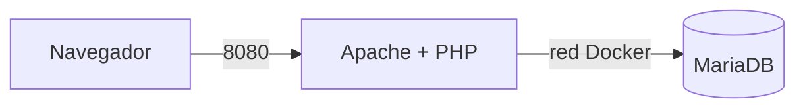

NIVEL 1:

Piensa: ¿por qué no le pasamos al servicio web la contraseña de root de la base de datos (env_file: .env)? Anota la respuesta en el README. 

Por seguridad. Si nos hackean la pagina web, asi evitamos que tengan el control de todo el servidor de la base de datos

Solo podrian tocar los datos del juego y nada mas

Copia en el README el resultado de SHOW GRANTS y contesta: ¿sobre qué base de datos tiene permisos el usuario jugador? ¿Por qué no usamos root desde la aplicación?

SHOW GRANTS: GRANT ALL PRIVILEGES ON `arcade`.* TO `jugador`@`%`

El usuario jugador solo tiene permisos para la base de datos que se llama arcade

No usamos root por el principio de minimo privilegio, es decir, la web solo necesita leer y guardar los records, asi que no hace falta darle permisos de administrador para todo el servidor

Anota en el README qué diferencia hay y por qué.  

Con docker compose down se borran los contenedores pero los datos se quedan guardados en el volumen

Si le ponemos el -v (docker compose down -v), nos cargamos el volumen tambien y perdemos toda la informacion de la base de datos

Moneda 1: En la tabla ranking hay una fila cuyo jugador es una moneda (no sale en la web). Encuéntrala con el cliente SQL y cópiala en el README. 

+----+--------------------+----------------+--------+
| id | jugador            | juego          | puntos |
+----+--------------------+----------------+--------+
|  1 | PAC-ANA            | Pac-Man        |  48200 |
|  2 | MARIO_84           | Donkey Kong    |  35100 |
|  3 | LARA_C             | Tetris         |  61750 |
|  4 | NEO                | Space Invaders |  27900 |
|  5 | BIMBA_XL           | Pac-Man        |  52300 |
|  6 | ZELDA              | Tetris         |  58400 |
|  7 | R2D2               | Space Invaders |  31200 |
|  8 | TRON               | Donkey Kong    |  29800 |
|  9 | MONEDA-1: ARC-7X3K | secreto        |      0 |
+----+--------------------+----------------+--------+

¿qué es un Dockerfile?

Es un archivo donde escribimos las instrucciones para crear una imagen nuestra a partir de la oficial, porque a veces a la oficial le faltan cosas (como aqui, que le falta una extension)

De esta forma se instala todo de forma automatica al levantarlo y queda guardado en nuestro GitHub

NIVEL 2:

Anota en el README qué diferencia hay y por qué.

PHP y la base de datos (MariaDB) se ejecutan en el servidor, o sea, dentro de los contenedores de Docker.

Pero el HTML, CSS y JavaScript se ejecutan en el cliente, que es el navegador.

Las horas pueden ser distintas porque el servidor coge la hora de dentro del contenedor y el cliente coge la hora del ordenador o movil de la persona que abre la pagina

Moneda 2: Aparece en la página cuando la conexión funciona. Cópiala en el README

NIVEL 3: 

Comprobaciones de seguridad realizadas:

Sin credenciales en el repositorio: He ejecutado el comando git ls-files y el archivo .env no sale en la lista. Ademas, con git log -p | grep -F (mi_contraseña) no sale nada, asi que no he subido las contraseñas por error.

Puerto 3306 no publicado: Haciendo un docker compose ps he comprobado que el puerto de MariaDB no sale hacia fuera de mi maquina.

Usuario de la app: He comprobado que la aplicacion entra usando el usuario jugador y no el superusuario roo.

Versiones ocultas: He ejecutado curl -I http://localhost:8080 y al mirar las cabeceras ya no se ve la version de Apache ni la de PHP

Moneda 3: te la doy yo en directo cuando compruebe curl -I y docker compose ps en tu equipo.

NIVEL 5:

Descripción del stack y las tecnologías:
Servidor web: Apache
Interprete: PHP, que se ejecuta en la parte del servidor
Base de datos: MariaDB, que tambien va en el servidor
Cliente: El navegador, que lee y ejecuta el HTML, CSS y el JavaScript

Diagrama de arquitectura en Mermaid:

Comandos de despliegue:

Para levantar y construir todo en local o en Play with Docker: docker compose up -d --build
Para parar y borrar los contenedores pero sin perder los datos: docker compose down
Para pararlo y borrarlo absolutamente todo (base de datos incluida): docker compose down -v

Problemas que me encontré y cómo los resolví:

Problema: Hice un cambio en el archivo init.sql para probar una cosa, pero al reiniciar el contenedor no pasaba nada y seguia igual
Solucion: Me di cuenta de que el init.sql solo se carga si la base de datos esta vacia del todo. Asi que hice un docker compose down -v para borrar el volumen viejo, volvi a levantar todo de cero y ya funciono perfectamente
